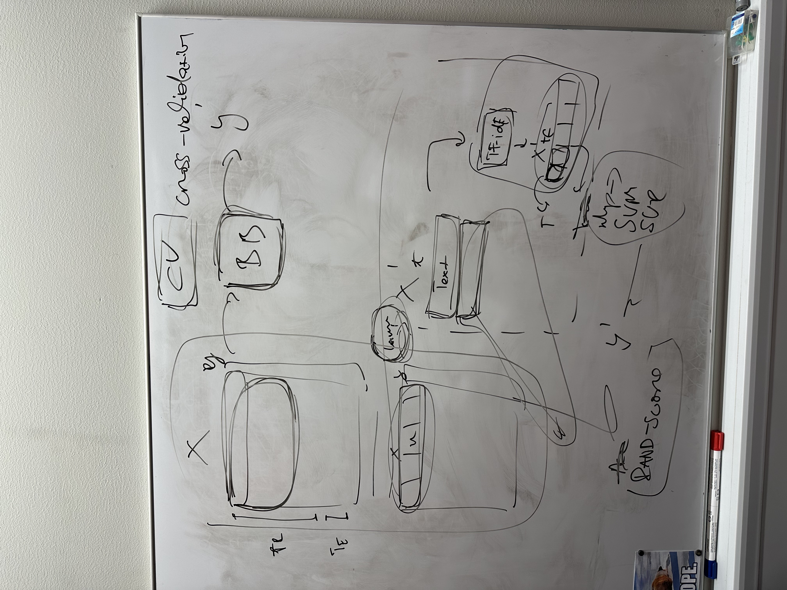
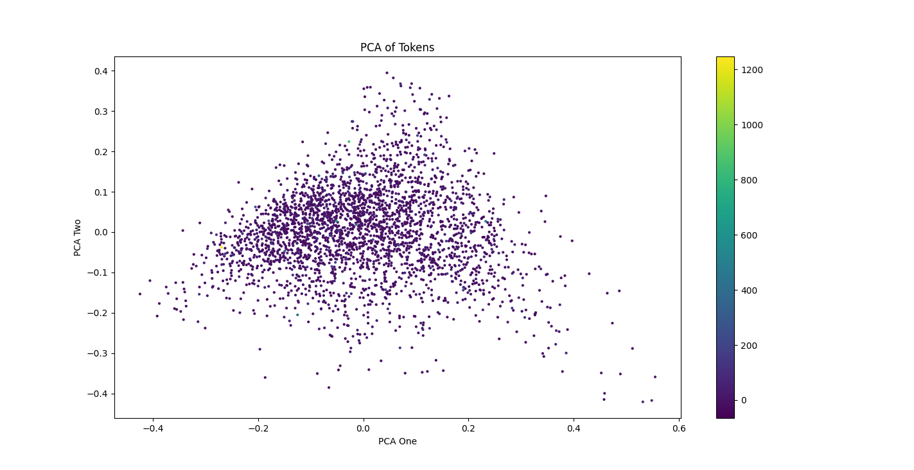
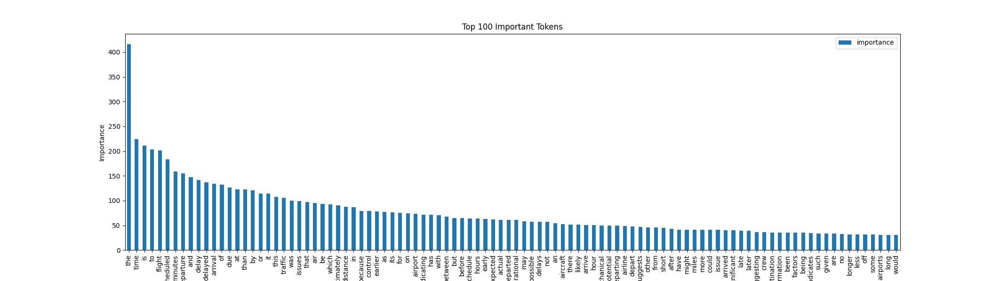

# Uczenie Maszyn - projekt

Predykcja opóźnienia lotu z wykorzystaniem LLM i klasycznych metod uczenia maszynowego.

## Opis problemu

W tym projekcie zajmiemy się badaniem skuteczności odtwarzania informacji poprzez LLM. Chcemy sprawdzic jak będą zachowywac się wyniki i jakie ewentualne uprzedzenia modelu znajdują się w jego wenwętrznej pamięci.

## Proponowana metoda

### Generowanie opisów

Z pomocą modelów opensource `llama3.2` oraz `gemma2` predykujemy opóźnienie lotu w postaci wartości oraz opisu (na potrzeby dalszego przetwarzania).

### Predykcja

Następnie na podstawie opisów próbowac będziemy wyznaczyc opóźnienie.

### Predykcja za pomocą innego algorytmu

Równolegle dokonamy predykcji opóźnienia za pomocą innego algorytmu, np. Bayesa

### Porównanie

Porównamy te trzy metody i zobaczymy, która najlepiej sobie radzi.

## Zestaw danych

Pracowac będziemy na danych lotów krajowych w USA z 2018 roku.

[Link do folderu z przygotowanymi zestawami danych](./llm_prepared_datasets)

## Plan badań

    1. Losowe wybranie 3000 rekordów do badań
    2. Wygenerowanie opisów przez LLM
    3. Predykcja na podstawie opisów
    4. Predykcja algorytmem Bayesa
    5. Porównanie i opracowanie wyników

## Schemat

## Tokenizacja

Do tokenizacji używamy modelu `TFIDF`.

### Proces tokenizacji

1. Wczytanie danych z pliku CSV do DataFrame.
2. Usunięcie wierszy z brakującymi wartościami.
3. Inicjalizacja wektoryzatora TF-IDF.
4. Dopasowanie i przekształcenie danych tekstowych za pomocą TF-IDF.
5. Utworzenie DataFrame z wartościami TF-IDF dla pierwszego dokumentu.
6. Sortowanie wartości TF-IDF w porządku malejącym.
7. Generowanie tokenów dla każdego dokumentu:
   - Dla każdego dokumentu tworzony jest słownik tokenów z ich wartościami TF-IDF.
8. Zapisanie tokenów do pliku JSON.

## Rzuty PCA dla 
natęzenie koloru zalezne od opoznienia
zbadanie dzieki temu jaki token wpływa na opóznienie

sklearn RepeatedStratifiedKFold

### Bierzemy tokeny i budujemy z nich model biorąc jakiś klasyfiktor

Natęzenie koloru zalezne od opóznienia.

sklearn RepeatedStratifiedKFold

### Bierzemy tokeny i budujemy z nich model biorąc jakiś klasyfiktor

Natęzenie koloru zalezne od opóznienia.

## Wykres wag tokenów

## Wykres wag tokenów

# Wyniki eksperymentów

## Badanie wygenerowanych przez LLM predykcji opóźnienia lotu

"Gołe" dane wyjściowe z modeli zostały poddane analizie na podstawie referencyjnego algorytmu zaproponowanego przez twórców zbioru danych. Predykcje LLMów `llama 3.2` oraz `gemma2` zostały za pomoca regresji liniowej poddane analizie cech kluczowych oraz zostały wyznaczone wartości R-squared oraz P-wartości dla cech.

### Kluczowe cechy

Przeanalizowaliśmy kluczowe cechy zestawu danych. Im większa wartość, tym cecha ma bardziej pozytywny wpływ na wynik predykcji. Wartości ujemne wykazuja negatywny wpływ na jakość predykcji.

#### Llama 3.2

| Feature             | Importance |
| ------------------- | ---------- |
| CRS_ELAPSED_TIME    | 55.23      |
| FL_MON              | 6.86       |
| ACTUAL_ELAPSED_TIME | -14.62     |
| DISTANCE            | -19.92     |

#### Gemma2

| Feature          | Importance |
| ---------------- | ---------- |
| DISTANCE         | 15.32      |
| DEST_HUB         | 3.64       |
| TAXI_OUT         | -2.58      |
| CRS_ELAPSED_TIME | -11.98     |

Jak widać, wpływowość cech dla jednego i drugiego modelu jest zupełnie odwrotna. Zapewne wynika to z faktu, ze modele uzywaja innych slow w opisach uzasadniajacych predykowane przez nie opóźnienie.

### R-squared

| MODEL     | R^2   |
| --------- | ----- |
| Llama 3.2 | 0.283 |
| Gemma2    | 0.370 |

### MSE i MAE

Obliczyliśmy średni błąd kwadratowy oraz średni bezwzględny błąd realnego opóźnienia i opóźnienia zaproponowanego poprzez LLM.

Porównaliśmy dodatkowo te błędy z dwóch LLM'ow: Llama3.2 i Gemma2

| MODEL     | Mean Squared Error (MSE) | Mean Absolute Error (MAE) |
| --------- | ------------------------ | ------------------------- |
| Llama 3.2 | 743223.039               | 254.332                   |
| Gemma2    | 3873.443                 | 47.424                    |

### Procentowa skutecznośc predykcji

Sprawdziliśmy dodatkowo na ile LLM jest w stanie chociaz zero-jedynkowo przewidziec czy lot będzie opóźniony, o czasie, czy przed czasem.

#### Poprawna predykcja znaku opóźnienia

Poprawna predykcja jest wtedy, kiedy znak wartości opóźnienia się zgadza. Optymistyczna jest wtedy kiedy wg LLM się nie spóźni, a w rzeczywistości się spóźnił. Pesymistyczna - na odwrót. Wartości ponizej podane są w procentach

| MODEL     | Correct | Overly optymistic | Overly pessimistic |
| --------- | ------- | ----------------- | ------------------ |
| Llama 3.2 | 49.429  | 16.292            | 32.342             |
| Gemma2    | 37.182  | 0.237             | 60.311             |

#### Poprawna predykcja wartości opóźnienia

Policzyliśmy ile procentowo wartości predykowane odbiegały od rzeczywistych. Wartości ponizej podane są w procentach.

| MODEL     | Perfect | Less than 5 min | Między 5 a 15 min | Między 15 a 30 min | Między 30 a 60 min | Między 60 a 120 min | Ponad 120 min |
| --------- | ------- | --------------- | ----------------- | ------------------ | ------------------ | ------------------- | ------------- |
| Llama 3.2 | 0.069   | 1.453           | 3.528             | 5.465              | 13.006             | 24.524              | 52.024        |
| Gemma2    | 0.406   | 2.980           | 7.958             | 18.693             | 44.903             | 22.35               | 3.115         |

## Porównanie wyników modeli

Dane przygotowane przez LLM po poddaniu procesowi tokenizacji włozyliśmy do róznych algorytmów aby sprawdzic skutecznośc tego procesu. Równocześnie te same algorytmy były wyuczone na orginalnych danych.

W kazdym z doświadczeń przeprowadziliśmy walidację krzyzową aby wykluczyc ewentualny pojedynczy błąd.

Pomiary wykonaliśmy na danych generowanych przez LLM Llama3.2

### Dane przygotowane przez LLM

| Regression model           | Vectorized train score | Vectorized test score | Crosss-validation scores                                                  | Mean cross-validation score |
| -------------------------- | ---------------------- | --------------------- | ------------------------------------------------------------------------- | --------------------------- |
| RandomForestRegression     | 0.844690872380323      | -0.11154107975677796  | [-0.29063336 -0.18080765 -0.28066903 -0.05043235 -0.1095188 ]             | -0.18241223900366052        |
| GradientBoostingRegression | 0.6993142048993068     | -0.1778680689960297   | [-0.14510287 -0.11282805 -0.2700713 -0.02029574 -0.05133228]              | -0.11992604845141405        |
| LinearRegression           | 0.9999739682396173     | -69.26632240911646    | [ -733.53510149 -2519.06498166 -855.78299881 -122.70435702 -819.99799222] | -1010.2170862381154         |
| Support Vector Regression  | -0.030827189738902527  | -0.05653884629676953  | [-0.05823419 -0.07564264 -0.05739531 -0.03831826 -0.0530673 ]             | -0.05653153947633309        |

### Dane orginalne

| Regression model           | Sample train score   | Sample test score    | Crosss-validation scores                                      | Mean cross-validation score |
| -------------------------- | -------------------- | -------------------- | ------------------------------------------------------------- | --------------------------- |
| RandomForestRegression     | 0.9775805333129626   | 0.9270127299610644   | [0.94839199 0.94138088 0.92257425 0.71830004 0.9601887 ]      | 0.8981671706858491          |
| GradientBoostingRegression | 0.9810845691255575   | 0.9484970913603092   | [0.92903047 0.94902349 0.93503578 0.73849326 0.9591626 ]      | 0.9021491210312274          |
| LinearRegression           | 1.0                  | 1.0                  | [1. 1. 1. 1. 1.]                                              | 1.0                         |
| Support Vector Regression  | -0.03229230044470932 | -0.02995514982548242 | [-0.02691651 -0.04337275 -0.02329514 -0.02977579 -0.03182853] | -0.03103774480132948        |
    - Dla każdego dokumentu tworzony jest słownik tokenów z ich wartościami TF-IDF.
8. Zapisanie tokenów do pliku JSON.

## Rzuty PCA dla 
natęzenie koloru zalezne od opoznienia
zbadanie dzieki temu jaki token wpływa na opóznienie

sklearn RepeatedStratifiedKFold

### Bierzemy tokeny i budujemy z nich model biorąc jakiś klasyfiktor

porównanie rzeczywistego delay i llm_generated_delay ( średni błąd )

# Wyniki eksperymentów

## Badanie wygenerowanych przez LLM predykcji opóźnienia lotu
### MSE i MAE

Obliczyliśmy średni błąd kwadratowy oraz średni bezwzględny błąd realnego opóźnienia i opóźnienia zaproponowanego poprzez LLM.

Porównaliśmy dodatkowo te błędy z dwóch LLM'ow: Llama3.2 i Gemma2

| MODEL     | Mean Squared Error (MSE) | Mean Absolute Error (MAE) |
| --------- | ------------------------ | ------------------------- |
| Llama 3.2 | 743223.039               | 254.332                   |
| Gemma2    | 3873.443                 | 47.424                    |

### Procentowa skutecznośc predykcji

Sprawdziliśmy dodatkowo na ile LLM jest w stanie chociaz zero-jedynkowo przewidziec czy lot będzie opóźniony, o czasie, czy przed czasem.

#### Poprawna predykcja znaku opóźnienia

Poprawna predykcja jest wtedy, kiedy znak wartości opóźnienia się zgadza. Optymistyczna jest wtedy kiedy wg LLM się nie spóźni, a w rzeczywistości się spóźnił. Pesymistyczna - na odwrót. Wartości ponizej podane są w procentach

| MODEL     | Correct | Overly optymistic | Overly pessimistic |
| --------- | ------- | ----------------- | ------------------ |
| Llama 3.2 | 49.429  | 16.292            | 32.342             |
| Gemma2    | 37.182  | 0.237             | 60.311             |

#### Poprawna predykcja wartości opóźnienia

Policzyliśmy ile procentowo wartości predykowane odbiegały od rzeczywistych. Wartości ponizej podane są w procentach.

| MODEL     | Perfect | Less than 5 min | Między 5 a 15 min | Między 15 a 30 min | Między 30 a 60 min | Między 60 a 120 min | Ponad 120 min |
| --------- | ------- | --------------- | ----------------- | ------------------ | ------------------ | ------------------- | ------------- |
| Llama 3.2 | 0.069   | 1.453           | 3.528             | 5.465              | 13.006             | 24.524              | 52.024        |
| Gemma2    | 0.406   | 2.980           | 7.958             | 18.693             | 44.903             | 22.35               | 3.115         |

## Porównanie wyników modeli

Dane przygotowane przez LLM po poddaniu procesowi tokenizacji włozyliśmy do róznych algorytmów aby sprawdzic skutecznośc tego procesu. Równocześnie te same algorytmy były wyuczone na orginalnych danych.

W kazdym z doświadczeń przeprowadziliśmy walidację krzyzową aby wykluczyc ewentualny pojedynczy błąd.

Pomiary wykonaliśmy na danych generowanych przez LLM Llama3.2

### Dane przygotowane przez LLM

| Regression model           | Vectorized train score | Vectorized test score | Crosss-validation scores                                                  | Mean cross-validation score |
| -------------------------- | ---------------------- | --------------------- | ------------------------------------------------------------------------- | --------------------------- |
| RandomForestRegression     | 0.844690872380323      | -0.11154107975677796  | [-0.29063336 -0.18080765 -0.28066903 -0.05043235 -0.1095188 ]             | -0.18241223900366052        |
| GradientBoostingRegression | 0.6993142048993068     | -0.1778680689960297   | [-0.14510287 -0.11282805 -0.2700713 -0.02029574 -0.05133228]              | -0.11992604845141405        |
| LinearRegression           | 0.9999739682396173     | -69.26632240911646    | [ -733.53510149 -2519.06498166 -855.78299881 -122.70435702 -819.99799222] | -1010.2170862381154         |
| Support Vector Regression  | -0.030827189738902527  | -0.05653884629676953  | [-0.05823419 -0.07564264 -0.05739531 -0.03831826 -0.0530673 ]             | -0.05653153947633309        |

### Dane orginalne

porównanie rzeczywistego delay i llm_generated_delay ( średni błąd )

# Wyniki eksperymentów

## Badanie wygenerowanych przez LLM predykcji opóźnienia lotu
### MSE i MAE
Obliczyliśmy średni błąd kwadratowy oraz średni bezwzględny błąd realnego opóźnienia i opóźnienia zaproponowanego poprzez LLM.

Porównaliśmy dodatkowo te błędy z dwóch LLM'ow: Llama3.2 i Gemma2

| MODEL | Mean Squared Error (MSE) | Mean Absolute Error (MAE) |
|-|-|-|
| Llama 3.2 | 743223.039 | 254.332 |
| Gemma2 | 3873.443 | 47.424 |

### Procentowa skutecznośc predykcji
Sprawdziliśmy dodatkowo na ile LLM jest w stanie chociaz zero-jedynkowo przewidziec czy lot będzie opóźniony, o czasie, czy przed czasem. 

#### Poprawna predykcja znaku opóźnienia
Poprawna predykcja jest wtedy, kiedy znak wartości opóźnienia się zgadza. Optymistyczna jest wtedy kiedy wg LLM się nie spóźni, a w rzeczywistości się spóźnił. Pesymistyczna - na odwrót. Wartości ponizej podane są w procentach

| MODEL | Correct | Overly optymistic | Overly pessimistic |
|-|-|-|-|
| Llama 3.2 | 49.429 | 16.292 | 32.342 |
| Gemma2 | 37.182 | 0.237 | 60.311 |

#### Poprawna predykcja wartości opóźnienia
Policzyliśmy ile procentowo wartości predykowane odbiegały od rzeczywistych. Wartości ponizej podane są w procentach.

| MODEL | Perfect | Less than 5 min | Między 5 a 15 min | Między 15 a 30 min | Między 30 a 60 min | Między 60 a 120 min | Pomnad 120 min |
|-|-|-|-|-|-|-|-|
| Llama 3.2 | 0.069 | 1.453 | 3.528 | 5.465 | 13.006 | 24.524 | 52.024 |
| Gemma2 | 0.406 | 2.980 | 7.958 | 18.693 | 44.903 | 22.35 | 3.115 |

## Porównanie wyników modeli
Dane przygotowane przez LLM po poddaniu procesowi tokenizacji włozyliśmy do róznych algorytmów aby sprawdzic skutecznośc tego procesu. Równocześnie te same algorytmy były wyuczone na orginalnych danych.

W kazdym z doświadczeń przeprowadziliśmy walidację krzyzową aby wykluczyc ewentualny pojedynczy błąd.

Pomiary wykonaliśmy na danych generowanych przez LLM Llama3.2

### Dane przygotowane przez LLM
| Regression model | Vectorized train score | Vectorized test score | Crosss-validation scores | Mean cross-validation score|
-|-|-|-|-
| RandomForestRegression | 0.844690872380323 | -0.11154107975677796 | [-0.29063336 -0.18080765 -0.28066903 -0.05043235 -0.1095188 ] | -0.18241223900366052 |
| GradientBoostingRegression | 0.6993142048993068 | -0.1778680689960297 | [-0.14510287 -0.11282805 -0.2700713  -0.02029574 -0.05133228] | -0.11992604845141405 |
| LinearRegression | 0.9999739682396173 | -69.26632240911646 | [ -733.53510149 -2519.06498166  -855.78299881  -122.70435702 -819.99799222] | -1010.2170862381154 |
| Support Vector Regression | -0.030827189738902527 | -0.05653884629676953 | [-0.05823419 -0.07564264 -0.05739531 -0.03831826 -0.0530673 ] | -0.05653153947633309 |

### Dane orginalne
| Regression model | Sample train score | Sample test score | Crosss-validation scores | Mean cross-validation score|
-|-|-|-|-
| RandomForestRegression | 0.9775805333129626 | 0.9270127299610644 | [0.94839199 0.94138088 0.92257425 0.71830004 0.9601887 ] | 0.8981671706858491 |
| GradientBoostingRegression | 0.9810845691255575 | 0.9484970913603092 | [0.92903047 0.94902349 0.93503578 0.73849326 0.9591626 ] | 0.9021491210312274 |
| LinearRegression | 1.0 | 1.0 | [1. 1. 1. 1. 1.] | 1.0 |
| Support Vector Regression | -0.03229230044470932 | -0.02995514982548242 | [-0.02691651 -0.04337275 -0.02329514 -0.02977579 -0.03182853] | -0.03103774480132948 |

    - Dla każdego dokumentu tworzony jest słownik tokenów z ich wartościami TF-IDF.
8. Zapisanie tokenów do pliku JSON.

## Rzuty PCA
Natęzenie koloru zalezne od opóznienia. 

# Wyniki eksperymentów

## Badanie wygenerowanych przez LLM predykcji opóźnienia lotu
### MSE i MAE
Obliczyliśmy średni błąd kwadratowy oraz średni bezwzględny błąd realnego opóźnienia i opóźnienia zaproponowanego poprzez LLM.

Porównaliśmy dodatkowo te błędy z dwóch LLM'ow: Llama3.2 i Gemma2

| MODEL | Mean Squared Error (MSE) | Mean Absolute Error (MAE) |
|-|-|-|
| Llama 3.2 | 743223.039 | 254.332 |
| Gemma2 | 3873.443 | 47.424 |

### Procentowa skutecznośc predykcji
Sprawdziliśmy dodatkowo na ile LLM jest w stanie chociaz zero-jedynkowo przewidziec czy lot będzie opóźniony, o czasie, czy przed czasem. 

#### Poprawna predykcja znaku opóźnienia
Poprawna predykcja jest wtedy, kiedy znak wartości opóźnienia się zgadza. Optymistyczna jest wtedy kiedy wg LLM się nie spóźni, a w rzeczywistości się spóźnił. Pesymistyczna - na odwrót. Wartości ponizej podane są w procentach

| MODEL | Correct | Overly optymistic | Overly pessimistic |
|-|-|-|-|
| Llama 3.2 | 49.429 | 16.292 | 32.342 |
| Gemma2 | 37.182 | 0.237 | 60.311 |

#### Poprawna predykcja wartości opóźnienia
Policzyliśmy ile procentowo wartości predykowane odbiegały od rzeczywistych. Wartości ponizej podane są w procentach.

| MODEL | Perfect | Less than 5 min | Między 5 a 15 min | Między 15 a 30 min | Między 30 a 60 min | Między 60 a 120 min | Pomnad 120 min |
|-|-|-|-|-|-|-|-|
| Llama 3.2 | 0.069 | 1.453 | 3.528 | 5.465 | 13.006 | 24.524 | 52.024 |
| Gemma2 | 0.406 | 2.980 | 7.958 | 18.693 | 44.903 | 22.35 | 3.115 |

## Porównanie wyników modeli
Dane przygotowane przez LLM po poddaniu procesowi tokenizacji włozyliśmy do róznych algorytmów aby sprawdzic skutecznośc tego procesu. Równocześnie te same algorytmy były wyuczone na orginalnych danych.

W kazdym z doświadczeń przeprowadziliśmy walidację krzyzową aby wykluczyc ewentualny pojedynczy błąd.

Pomiary wykonaliśmy na danych generowanych przez LLM Llama3.2

### Dane przygotowane przez LLM
| Regression model | Vectorized train score | Vectorized test score | Crosss-validation scores | Mean cross-validation score|
-|-|-|-|-
| RandomForestRegression | 0.844690872380323 | -0.11154107975677796 | [-0.29063336 -0.18080765 -0.28066903 -0.05043235 -0.1095188 ] | -0.18241223900366052 |
| GradientBoostingRegression | 0.6993142048993068 | -0.1778680689960297 | [-0.14510287 -0.11282805 -0.2700713  -0.02029574 -0.05133228] | -0.11992604845141405 |
| LinearRegression | 0.9999739682396173 | -69.26632240911646 | [ -733.53510149 -2519.06498166  -855.78299881  -122.70435702 -819.99799222] | -1010.2170862381154 |
| Support Vector Regression | -0.030827189738902527 | -0.05653884629676953 | [-0.05823419 -0.07564264 -0.05739531 -0.03831826 -0.0530673 ] | -0.05653153947633309 |

### Dane orginalne
| Regression model | Sample train score | Sample test score | Crosss-validation scores | Mean cross-validation score|
-|-|-|-|-
| RandomForestRegression | 0.9775805333129626 | 0.9270127299610644 | [0.94839199 0.94138088 0.92257425 0.71830004 0.9601887 ] | 0.8981671706858491 |
| GradientBoostingRegression | 0.9810845691255575 | 0.9484970913603092 | [0.92903047 0.94902349 0.93503578 0.73849326 0.9591626 ] | 0.9021491210312274 |
| LinearRegression | 1.0 | 1.0 | [1. 1. 1. 1. 1.] | 1.0 |
| Support Vector Regression | -0.03229230044470932 | -0.02995514982548242 | [-0.02691651 -0.04337275 -0.02329514 -0.02977579 -0.03182853] | -0.03103774480132948 |

